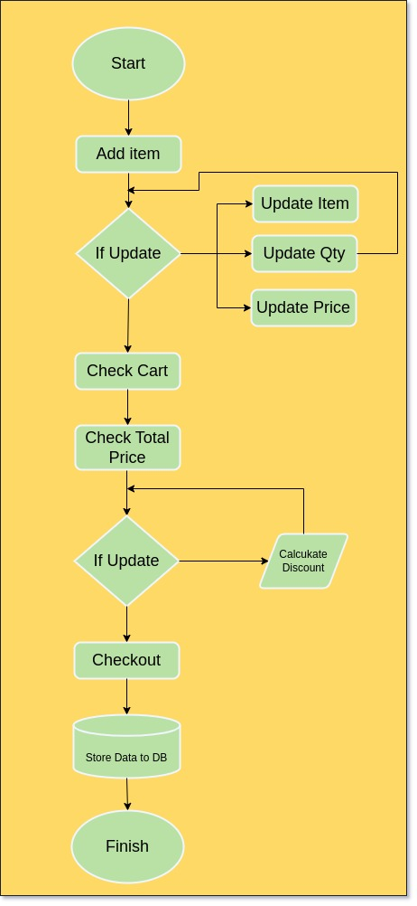
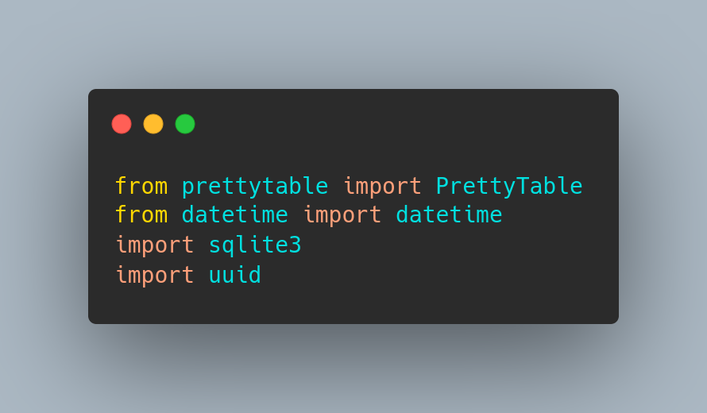
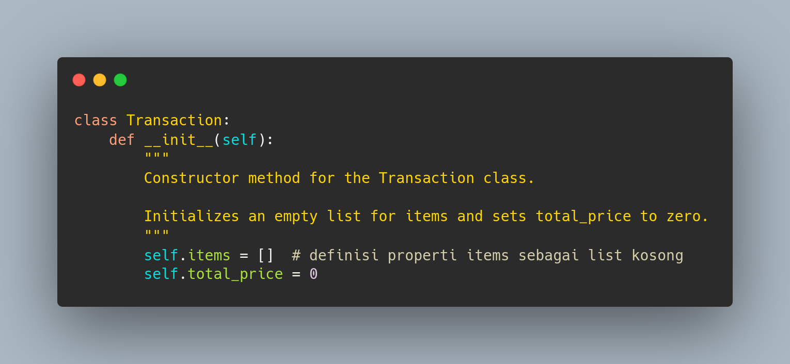

# **Super Cashier 😃**

    Disclaimer: 
    This repository is an individual project created for the Software and Data Engineering course at PACMANN.

## **How To Use**
---
### Running Application on Python Console:
1. Clone this repository into your local machine.
2. Open your favorite terminal and locate to **Super Cashier App** directory.
3. Download and create python virtual environtment. For example using `virtualenv .myenv` and activate using `source .myenv/bin/activate`.
4. Install the dependencies using `pip -r install requierements.txt`
5. Iniate the database using command `python init_db.py`
6. Running the **Super Cashier App** with command `python cashier.py`

### Running Applcation on Flask:
1. Follow similar steps 1-5 above.
2. On your terminal execute this command `flask run` to running application.
3. Open your browser and go to [127.0.0.1:5000](127.0.0.1:5000) or [localhost:5000](localhost:5000).

## **Objective**
---
Develop a self-service cashier application that enables users to add items to their shopping cart, update or delete items, remove transactions, view their shopping cart, and checkout by themselves. The application should provide a user-friendly interface that allows customers to easily navigate through the different options. Moreover, it should be able to handle multiple transactions simultaneously to ensure a seamless shopping experience for all users.

## **Flowchart**
---

## **Code Explainations**
### main.py
This script is the class  for the **super cashier app**. In this class there are consists of several method, such as:
 - add item
 - check item
 - update item (inc. update qty and update price_)
 - delete item
 - remove transaction
 - check carts
 - checkouts
 - create uuid
  
Here is the explaination for every method:

1. Importing Library

2. Defines Class Transaction()

The above code defines a class called Transaction which contains a constructor method called init(). This constructor method initializes the class with two properties, items and total_price. The items property is defined as an empty list and total_price is set to zero. This class is designed to represent a transaction, and the constructor method initializes the transaction by creating an empty list for the items and setting the total price to zero.

3. Method add_item()

The code above defines a method called 'add_item' within a class that is used to add an item to a transaction. This method takes a tuple consisting of the name, quantity, and price of the item to be added. The method then appends this tuple to the list of items in the transaction and calculates the total price by multiplying the quantity of the item with its price and adding it to the total price attribute of the transaction object. Finally, the method returns None as it doesn't have a return statement.
   
4. Method check_item()

This is a method in a class that checks if a certain item exists in a transaction. The method takes an argument called 'item_name' which is a string representing the name of the item to be checked. 

5. Method update_item()

6. Method update_qty()

7. Method update_price()

8. Method delete_item()

9. Method remove_transaction()

10. Method check_order()

11. Method check_out()

12. Method crate_uuid()

### **db_init.py**
This purpose of this code to create a tables transactions and columns to storing transactions data from **Super Cashier App**. For this project will using sqlite for database server.

### **super_cashier.py**
This script is driver script to running **Super Cashier App**, in this script instanced from Class transaction in main.py. 

## Test Case

### Python Console/Terminal

1. Running Aplication with command `python super_cashier.py`

2. Add Shopping Item

3. Update Shopping Item Qty

4. Delete Shopping Item

5. Check Shopping Cart

6. Checkout Transaction

7. Exit Application

### Flask App

1. Running the flask app using this command `flask run`
   

2. Open browser and go to [127.0.0.1:5000](127.0.0.1:5000), you will see the interface of Super Cashier App. You can add shopping items by fill the "Tambah Item" form and hit "Tambah Item" Button to submit the order.
    

3. Check shopping chart or order items below the form. 
    

4. You can update/edit the item by hit "Edit" button.
   

   After update item:
   

5. You also can delete the item by hit "Delete" button and befor the item deleted, the system will ask delete confirmation.

    

6. Checkout the transaction by click "Checkout" button.
   
